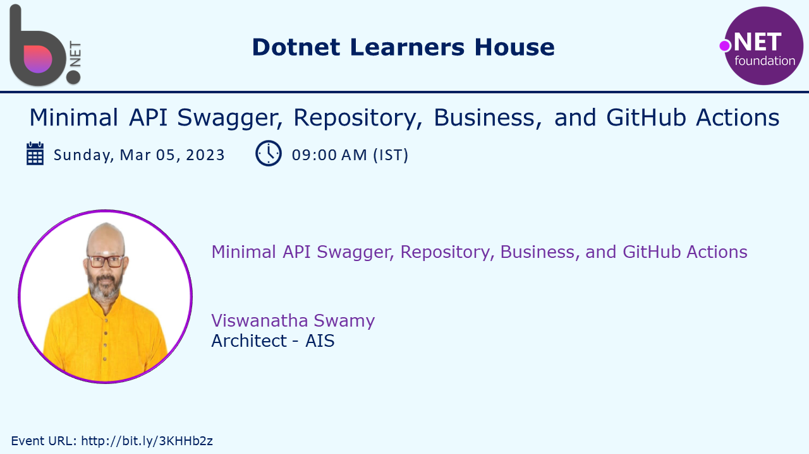
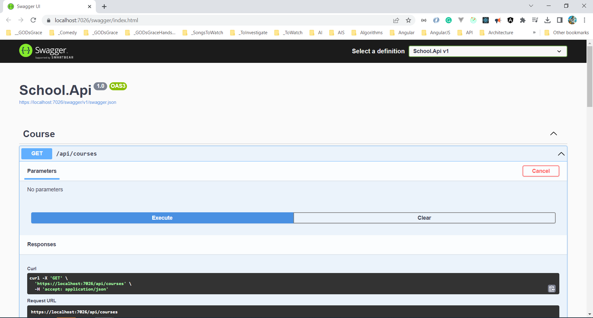
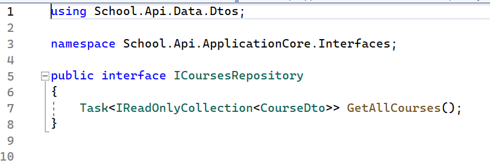
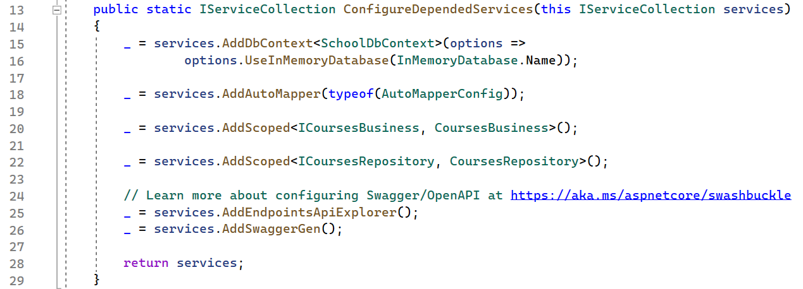
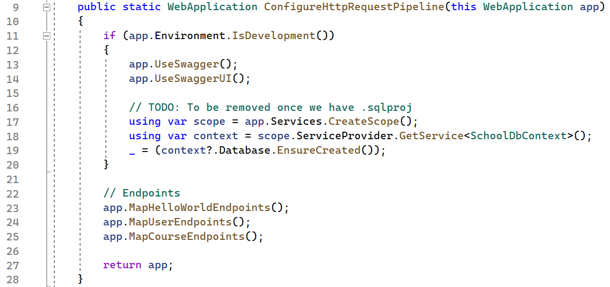
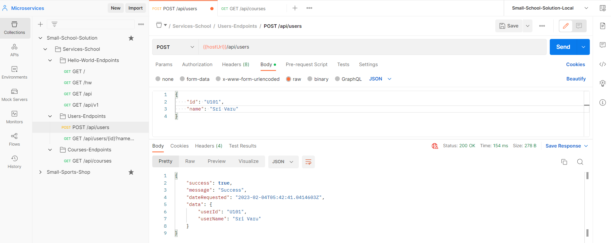
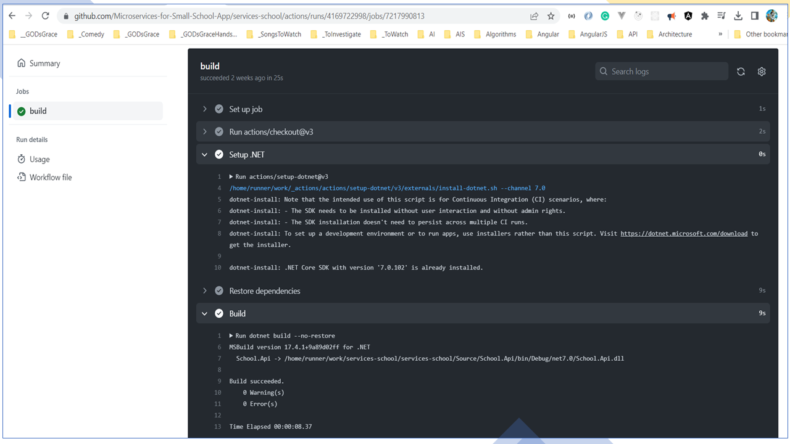

# Minimal API .NET 7 - Swagger, Repository, Business Layer, and GitHub Actions

## Date Time: 05-Mar-2023 at 09:00 AM IST

## Event URL: [https://www.meetup.com/dot-net-learners-house-hyderabad/events/291609769](https://www.meetup.com/dot-net-learners-house-hyderabad/events/291609769)

## YouTube URL: [https://www.youtube.com/watch?v=7iWWTCZCJBg](https://www.youtube.com/watch?v=7iWWTCZCJBg)



---

### Software/Tools

> 1. OS: Windows 10 x64
> 1. .NET 7
> 1. Visual Studio 2022
> 1. Visual Studio Code

### Prior Knowledge

> 1. Programming knowledge in C#
> 1. Azure
> 1. Angular 15
> 1. .NET Razor/Blazor WASM

## Technology Stack

> 1. .NET 7, Azure

## Information


## What are we doing today?

> 1. Adding Swagger Dependencies
> 1. WithTags().WithName().Produces(200).ProducesProblem(500);
> 1. Creating Repository Layer
> 1. Creating Business Layer
> 1. Dependency Injection of Swagger, Repository Layer, Business Layer
> 1. Move Service Dependencies into a Extension Class
> 1. Move Http Request Pipeline Dependencies into a Extension Class
> 1. Update Postman Collections to test the API (Environment Variables, and Collections)
> 1. GitHub Actions to build API

### Please refer to the [**Source Code**](https://github.com/Microservices-for-Small-Computer-School/Services-Courses) of today's session for more details

---


---

## 1. Adding Swagger Dependencies

> 1. Discussion and Demo

**Reference(s):**

> 1. [https://learn.microsoft.com/en-us/aspnet/core/fundamentals/minimal-apis/openapi?view=aspnetcore-7.0](https://learn.microsoft.com/en-us/aspnet/core/fundamentals/minimal-apis/openapi?view=aspnetcore-7.0)



```xml
<ItemGroup>
    <PackageReference Include="Microsoft.AspNetCore.OpenApi" Version="7.0.3" />
    <PackageReference Include="Swashbuckle.AspNetCore" Version="6.5.0" />
</ItemGroup>
```

```csharp
// Learn more about configuring Swagger/OpenAPI at https://aka.ms/aspnetcore/swashbuckle
_ = builder.Services.AddEndpointsApiExplorer();
_ = builder.Services.AddSwaggerGen();
```

```csharp
if (app.Environment.IsDevelopment())
{
    app.UseSwagger();
    app.UseSwaggerUI();
}
```

## 2. WithTags().WithName().Produces(200).ProducesProblem(500)

> 1. Discussion and Demo

```csharp
_ = group.MapGet(CoursesRoutes.Root, async ([FromServices] SchoolDbContext schoolDbContext, IMapper mapper) =>
{
    var coursesResponse = ApiResponseDto<IReadOnlyCollection<CourseDto>>.Create(
            mapper.Map<IReadOnlyCollection<CourseDto>>(await schoolDbContext.Courses.ToListAsync())
        );
    return Results.Ok(coursesResponse);
})
  .AllowAnonymous()
  .WithName("GetAllCourses")
  .Produces<ApiResponseDto<IReadOnlyCollection<CourseDto>>>(StatusCodes.Status200OK)
  .ProducesProblem(StatusCodes.Status500InternalServerError)
  .WithOpenApi();
```

## 3.Creating Repository Layer

> 1. Discussion and Demo



## 4.Creating Business Layer

> 1. Discussion and Demo


## 5.Dependency Injection of Swagger, Repository Layer, Business Layer

> 1. Discussion and Demo

```csharp
_ = services.AddScoped<ICoursesBusiness, CoursesBusiness>();
_ = services.AddScoped<ICoursesRepository, CoursesRepository>();

// Learn more about configuring Swagger/OpenAPI at https://aka.ms/aspnetcore/swashbuckle
_ = services.AddEndpointsApiExplorer();
_ = services.AddSwaggerGen();
```

## 6.Move Service Dependencies into a Extension Class

> 1. Discussion and Demo



## 7.Move Http Request Pipeline Dependencies into a Extension Class

> 1. Discussion and Demo



## 8.Update Postman Collections to test the API (Environment Variables, and Collections)

> 1. Discussion and Demo



## 9.GitHub Actions to build API

> 1. Discussion and Demo



---

## SUMMARY / RECAP / Q&A

> 1. SUMMARY / RECAP / Q&A
> 2. Any open queries, I will get back through meetup chat/twitter.

---

## What is Next? session `5` of `9` Sessions on 19 Mar, 2023

> 1. Logging using Serilog
> 1. Dependency Injection of CORS
> 1. Angular 15 (SPA with Standalone components) integration with Minimal API Only GetAllCourses() Local API Endpoint
> 1. Deploy Minimal API to Azure App Service using VS 2022
> 1. Angular 15 (SPA with Standalone components) integration with Minimal API Only GetAllCourses() Azure Hosted API Endpoint
> 1. SUMMARY / RECAP / Q&A
