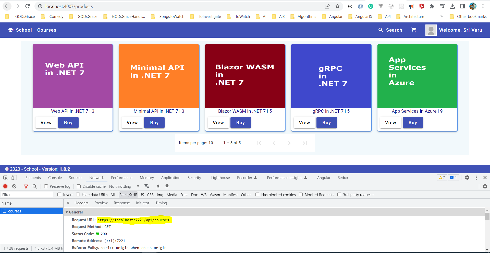
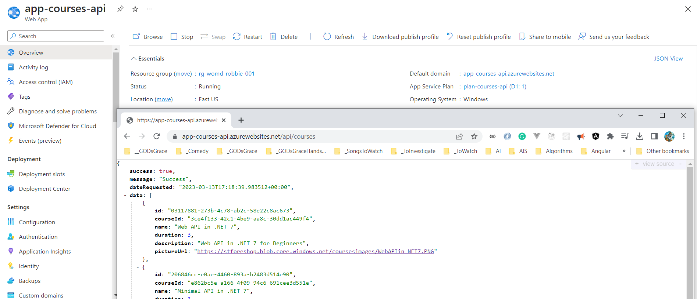
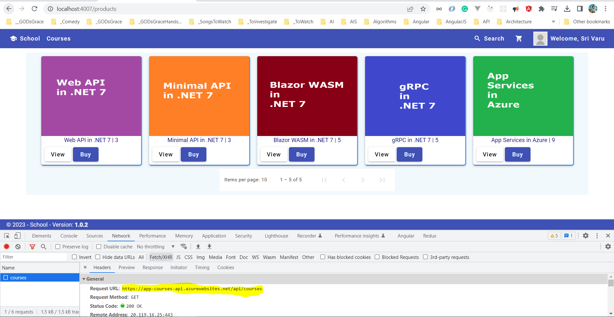

# Minimal API .NET 7 - Serilog, CORS, Azure App Service, and Angular 15 UI

## Date Time: 13-Mar-2023 at 08:30 PM IST

---

### Software/Tools

> 1. OS: Windows 10 x64
> 1. .NET 7
> 1. Visual Studio 2022
> 1. Visual Studio Code
> 1. Postman

### Prior Knowledge

> 1. Programming knowledge in C#

## Technology Stack

> 1. .NET 7, Azure, Angular 15

## Information


## What are we doing today?

> 1. Logging using Serilog
> 1. Configuration CORS in Development Mode
> 1. Angular 15 (SPA with Standalone components) integration with Minimal API Only GetAllCourses() Local API Endpoint
> 1. Deploy Minimal API to Azure App Service using VS 2022 / VS Code
> 1. Angular 15 (SPA with Standalone components) integration with Minimal API Only GetAllCourses() Azure Hosted API Endpoint
> 1. SUMMARY / RECAP / Q&A

### Please refer to the [**Source Code**](https://github.com/Microservices-for-Small-Computer-School/Services-Courses) of today's session for more details

---


---

## 1. Logging using Serilog

> 1. Discussion and Demo

```xml
<ItemGroup>
    <PackageReference Include="Swashbuckle.AspNetCore" Version="6.5.0" />
</ItemGroup>
```

```csharp
builder.Logging.ClearProviders();

builder.Logging.AddSerilog(new LoggerConfiguration()
    .WriteTo.Debug()
    .WriteTo.Console()
    .ReadFrom.Configuration(builder.Configuration)
    .Enrich.FromLogContext()
    .CreateLogger());
```

## 2. Configuration CORS in Development Mode

> 1. Discussion and Demo

```csharp
_ = services.AddCors(options => {
            options.AddPolicy("AllowAll", policy => policy.AllowAnyHeader()
                                                            .AllowAnyOrigin().AllowAnyMethod());
        });
```

```csharp
if (app.Environment.IsDevelopment())
{
    app.UseCors("AllowAll");
}
```

## 3. Angular 15 (SPA with Standalone components) integration with Minimal API Only GetAllCourses() Local API Endpoint

> 1. Discussion and Demo



## 4. Deploy Minimal API to Azure App Service using VS 2022 / VS Code

> 1. Discussion and Demo



## 5. Angular 15 (SPA with Standalone components) integration with Minimal API Only GetAllCourses() Azure Hosted API Endpoint

> 1. Discussion and Demo



---

## SUMMARY / RECAP / Q&A

> 1. SUMMARY / RECAP / Q&A
> 2. Any open queries, I will get back through meetup chat/twitter.

---

## What is Next? session `5` of `9` Sessions on 19 Mar, 2023

> 1. .SQLProj
> 1. SUMMARY / RECAP / Q&A
